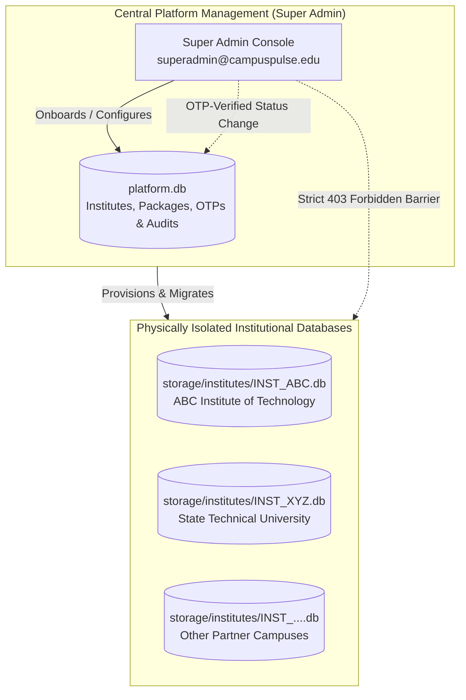
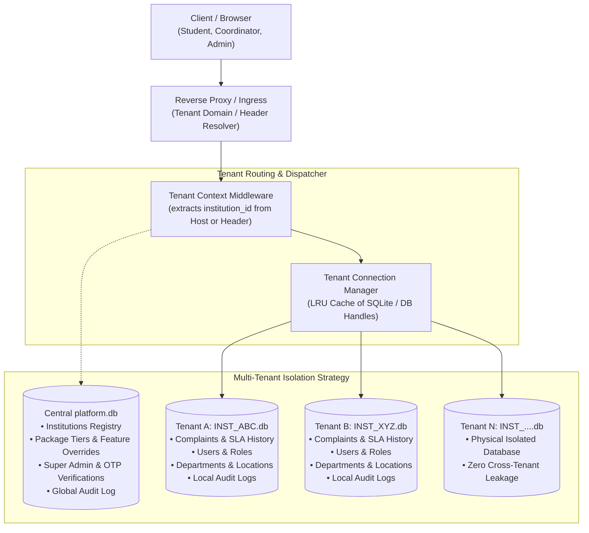
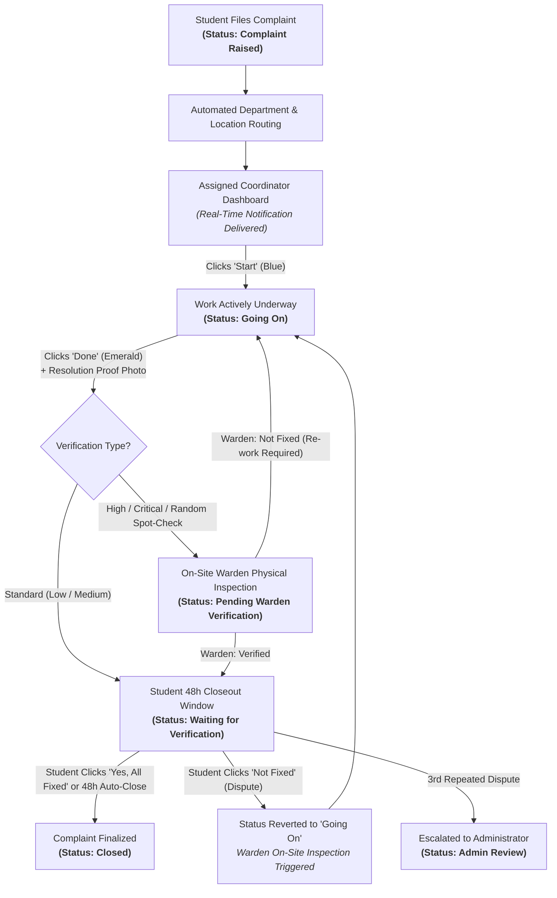

# Campus Pulse — Multi-Institute Campus Governance & Grievance SaaS Platform

[](https://python.org)
[](https://fastapi.tiangolo.com)
[](https://react.dev)
[](https://vitejs.dev)
[](https://tailwindcss.com)
[](https://sqlite.org)
[](LICENSE)

🌐 **Official Showcase Website:** [https://gowthame23.github.io/campus_pulse/](https://gowthame23.github.io/campus_pulse/)  
🚀 **Live Production Application:** [https://campuspulse-frontend-wlws.onrender.com](https://campuspulse-frontend-wlws.onrender.com)  
🩺 **Backend API Health:** [https://campus-pulse-et7u.onrender.com/health](https://campus-pulse-et7u.onrender.com/health)

### 🔑 Try the Live Demo
Open the live app and click **Demo accounts** (top right, under the language menu) to sign in with one click. All addresses are fake demo mailboxes, and the demo data resets whenever the free server restarts.

| Role | Email | Password |
| :--- | :--- | :--- |
| Super Admin | `superadmin@campuspulse.edu` | `Superadmin@123` |
| Administrator | `admin@campuspulse.edu` | `Admin@123` |
| App Manager 1 / 2 | `manager1@campuspulse.edu` / `manager2@campuspulse.edu` | `Manager@123` |
| Coordinator 1 / 2 | `coordinator1@campuspulse.edu` / `coordinator2@campuspulse.edu` | `Coord@123` |
| Student 1 / 2 | `student1@campuspulse.edu` / `student2@campuspulse.edu` | `Student@123` |
| Warden 1 / 2 | `warden1@campuspulse.edu` / `warden2@campuspulse.edu` | `Warden@123` |

> The first request after the server has been idle can take up to a minute while Render's free plan wakes it up.

**Campus Pulse** is a high-accountability, multi-tenant campus grievance, emergency response, and facilities management SaaS platform. Engineered to eliminate the "black hole" of collegiate ticketing systems, Campus Pulse enforces physical tenant data isolation, direct coordinator ownership, tamper-evident photo verification, zero-knowledge anonymous whistleblowing, and automated SLA escalations.

---

## 🏛️ Multi-Institute SaaS Architecture & Data Isolation

Campus Pulse provides scalable multi-tenancy while guaranteeing complete data isolation and privacy across educational institutions.


```mermaid
flowchart TD
    subgraph PlatformLayer["Central Platform Management (Super Admin)"]
        PDB[("platform.db<br/>Institutes, Packages, OTPs & Audits")]
        SA["Super Admin Console<br/>superadmin@campuspulse.edu"] -->|Onboards / Configures| PDB
        SA -.->|"OTP-Verified Status Change"| PDB
    end

    subgraph TenantIsolation["Physically Isolated Institutional Databases"]
        T1[("storage/institutes/INST_ABC.db<br/>ABC Institute of Technology")]
        T2[("storage/institutes/INST_XYZ.db<br/>State Technical University")]
        TN[("storage/institutes/INST_....db<br/>Other Partner Campuses")]
    end

    PlatformLayer -->|Provisions & Migrates| TenantIsolation
    SA -.->|Strict 403 Forbidden Barrier| TenantIsolation
```

### 1. Physical Database Isolation
* **Separate Tenant Databases**: Each registered institution receives its own independent SQLite database located at `storage/institutes/{institution_id}.db`.
* **Zero Leakage**: Student records, complaints, attachments, comments, audit trails, and physical locations are physically segregated. No institution can ever view or query another institution's data.
* **Super Admin Data Boundary**: Super Admins maintain platform infrastructure, onboard institutes, and configure packages, but are strictly prohibited (`HTTP 403 Forbidden`) from viewing institutional operational records.

### 2. Subscription Packages & Feature Entitlement
Campus Pulse features a modular entitlement engine gating capabilities per tier:

| Feature Capability | Basic | Intermediate | Premium |
| :--- | :---: | :---: | :---: |
| Student Complaint Filing & Tracking | ✅ | ✅ | ✅ |
| Automated Coordinator Routing | ✅ | ✅ | ✅ |
| 3-Stage Lifecycle & SLA Engine | ✅ | ✅ | ✅ |
| Role-Based Notifications & Audit Logs | ✅ | ✅ | ✅ |
| Location-Scoped Warden Verification | ❌ | ✅ | ✅ |
| Anonymous Whistleblower Safety Reports | ❌ | ✅ | ✅ |
| Duplicate Image Detection | ❌ | ✅ | ✅ |
| Executive Analytics Dashboard | ❌ | ✅ | ✅ |
| Lost & Found Campus Repository | ❌ | ❌ | ✅ |
| Resource & Facility Room Booking | ❌ | ❌ | ✅ |
| AI Automated Classification | ❌ | ❌ | ✅ |

*Dynamic Feature Overrides*: Super Admins can customize individual feature flags per institute without migrating database schemas.

### 3. Dual-Factor Email OTP Institute Security
* **Tamper-Proof Status Management**: Each institution card in the Super Admin registry has a **Deactivate** / **Reactivate** button. The change only goes through after the Super Admin enters a 6-digit one-time password (OTP) emailed to their registered address. If the email cannot be sent, no code is issued. In demo mode (`DEMO_MODE=true`) no email is sent and the code is shown on screen instead, because the demo mailboxes do not exist.
* **Brute-Force Protection**: OTPs expire after 10 minutes, use cryptographic salt hashing, and automatically lock after 5 failed attempts.
* **Instant Session Block**: When an institution is marked `Inactive`, every request from its users (except the Super Admin) is refused with `403 Forbidden` until it is reactivated. No data is deleted.

---

## 🏗️ Multi-Tenant Architecture & Tradeoff Analysis


```mermaid
flowchart TD
    Client["Client / Browser<br/>(Student, Coordinator, Admin)"]
    Proxy["Reverse Proxy / Ingress<br/>(Tenant Domain / Header Resolver)"]
    
    subgraph RoutingLayer["Tenant Routing & Dispatcher"]
        Resolve["Tenant Context Middleware<br/>(extracts institution_id from Host or Header)"]
        Pool["Tenant Connection Manager<br/>(LRU Cache of SQLite / DB Handles)"]
    end

    subgraph DataIsolation["Multi-Tenant Isolation Strategy"]
        PlatformDB[("Central platform.db<br/>• Institutions Registry<br/>• Package Tiers & Feature Overrides<br/>• Super Admin & OTP Verifications<br/>• Global Audit Log")]
        
        TenantA[("Tenant A: INST_ABC.db<br/>• Complaints & SLA History<br/>• Users & Roles<br/>• Departments & Locations<br/>• Local Audit Logs")]
        TenantB[("Tenant B: INST_XYZ.db<br/>• Complaints & SLA History<br/>• Users & Roles<br/>• Departments & Locations<br/>• Local Audit Logs")]
        TenantN[("Tenant N: INST_....db<br/>• Physical Isolated Database<br/>• Zero Cross-Tenant Leakage")]
    end

    Client --> Proxy
    Proxy --> Resolve
    Resolve --> Pool
    Resolve -.-> PlatformDB
    Pool --> TenantA
    Pool --> TenantB
    Pool --> TenantN
```

### Why One SQLite Database Per Tenant?
1. **Physical Data Isolation (Zero Cross-Tenant Leakage)**: Queries never need complex `WHERE institution_id = ?` clauses that can be accidentally omitted in ORMs or raw SQL. A catastrophic data leak between rival colleges or departments is physically impossible because each institution's data resides in its own isolated file.
2. **Simplified Tenant Lifecycle (Point-in-Time Backups & Archival)**: Backing up, restoring, offboarding, or moving an institution to another storage tier is simply a file-system copy (`shutil.copy2` or SQLite `.backup()`) with zero downtime or locks for other institutions.
3. **Tailored SLAs, Upgrades, & Maintenance Windows**: Migrations can be applied incrementally tenant-by-tenant. If a migration fails on one tenant, no other tenant's operations are affected.
4. **Zero-Resource Idle Tenants**: An inactive small college incurs zero memory overhead, database server connection pooling cost, or idle compute.
5. **Regulatory & Compliance Alignment (FERPA, GDPR)**: Individual institution databases can easily be retained, encrypted with separate tenant keys, or deleted on contract termination without complex schema scrubbing.

### What Changes at Scale?
1. **Connection Pooling & File Handle Limits**: With thousands of simultaneous active tenants, operating system open file descriptors (`nofile`) can be exhausted. A dynamic connection cache with LRU eviction must close idle SQLite handles.
2. **Horizontal Scaling Across Multi-Nodes**: Local SQLite files bind a tenant to a single container or server. At multi-node scale, tenants must either use network replication (e.g., Litestream / LiteFS replicated to object storage) or migrate to a managed distributed database (PostgreSQL with row-level security or Citus/schema-per-tenant).
3. **Cross-Tenant Aggregation & Global Analytics**: Platform-wide reporting across hundreds of institutions requires federated ETL (e.g., DuckDB querying across multiple tenant databases or periodic data replication into an analytical warehouse).
4. **Write Concurrency per Tenant**: SQLite supports one concurrent writer per database file (WAL mode allows concurrent readers). For large campuses with thousands of simultaneous ticket updates, write lock contention requires partitioning into micro-databases or transitioning busy tenants to PostgreSQL.

---

## 🎯 Accountable 3-Stage Complaint Lifecycle

Campus Pulse replaces convoluted 12-state bureaucratic queues with a streamlined **3-stage lifecycle**:

$$\text{Complaint Raised} \xrightarrow{\quad\text{Coordinator Starts}\quad} \text{Going On} \xrightarrow{\quad\text{Coordinator Done}\quad} \text{Fixed} \xrightarrow{\quad\text{48h Verification / Dispute}\quad} \text{Closed}$$


```mermaid
flowchart TD
    A["Student Files Complaint<br/><b>(Status: Complaint Raised)</b>"] --> B["Automated Department & Location Routing"]
    B --> C["Assigned Coordinator Dashboard<br/><i>(Real-Time Notification Delivered)</i>"]
    
    C -->|"Clicks 'Start' (Blue)"| D["Work Actively Underway<br/><b>(Status: Going On)</b>"]
    
    D -->|"Clicks 'Done' (Emerald)<br/>+ Resolution Proof Photo"| E{"Verification Type?"}
    
    E -- "Standard (Low / Medium)" --> F["Student 48h Closeout Window<br/><b>(Status: Waiting for Verification)</b>"]
    E -- "High / Critical / Random Spot-Check" --> G["On-Site Warden Physical Inspection<br/><b>(Status: Pending Warden Verification)</b>"]
    
    G -- "Warden: Not Fixed (Re-work Required)" --> D
    G -- "Warden: Verified" --> F
    
    F -->|"Student Clicks 'Yes, All Fixed' or 48h Auto-Close"| H["Complaint Finalized<br/><b>(Status: Closed)</b>"]
    F -->|"Student Clicks 'Not Fixed' (Dispute)"| I["Status Reverted to 'Going On'<br/><i>Warden On-Site Inspection Triggered</i>"] --> D
    F -->|"3rd Repeated Dispute"| J["Escalated to Administrator<br/><b>(Status: Admin Review)</b>"]
```

### Deterministic SLA Deadlines
Every complaint receives a deterministic resolution deadline upon registration:
* **Critical**: 4 hours *(immediate escalation alert on breach)*
* **High**: 24 hours
* **Medium**: 48 hours
* **Low**: 72 hours

An automated background scheduler monitors active tickets, dispatching multi-tier escalation warnings when deadlines approach or breach.

---

## 🛡️ Anti-Fraud & Quality Assurance Architecture

Traditional campus systems suffer from "phantom fixes"—tickets marked resolved without repairs or with stock photos. Campus Pulse eliminates this through:

### 1. SHA-256 Duplicate Image Fingerprinting
* The raw binary bytes of every uploaded photo are hashed via **SHA-256** upon receipt.
* The system queries historical records:
  ```sql
  SELECT complaint_id FROM attachments WHERE sha256 = ? AND complaint_id != ? LIMIT 1
  ```
* If the exact photo was ever uploaded to another complaint, the system immediately tags it with a **`REUSED`** fraud alert flag.

### 2. EXIF Timestamp Tamper Verification
* For JPEG/JPG uploads, the backend extracts the embedded camera metadata (`DateTimeOriginal`, EXIF tag 36867).
* If an "after repair" proof photo has a capture timestamp **older than when the repair job was actually started**, the system flags it as **`OLDER_THAN_JOB`**.

### 3. Photo-Skip Streak Penalty
* If a coordinator repeatedly marks complaints done without photo proof, the system tracks their skip streak. Reaching the threshold automatically locks the ticket and mandates an in-person Warden physical inspection.

---

## 🔒 Privacy-First Anonymous Whistleblowing

Students often stay silent about ragging, harassment, mental health crises, or facility hazards due to fear of academic or social retaliation. Campus Pulse provides **genuine zero-knowledge anonymous reporting**:

```
[Student Submits Report]
         │
         ├──► safety_reports (report_id, case_code, category, description, status)  ← Accessible by Admins
         │
         └──► safety_report_identity (report_id, reporter_user_id, revealed = 0)     ← Sealed in Isolation
```

1. **Table-Level Structural Segregation**:
   The primary `safety_reports` table has **no foreign keys to students**. Regular administration screens, analytics, and two-way messaging only ever touch `safety_reports`.
2. **Anonymous 2-Way Chat**:
   Students track progress and chat bidirectionally with administrators using an ephemeral **Case Code** without logging in.
3. **Dual-Control Identity Unsealing Gate**:
   Identity unsealing can only occur during an extreme life-safety crisis or formal disciplinary misuse:
   * Requires Administrator role privilege.
   * Mandates **live password re-authentication** (`PBKDF2-HMAC-SHA256`).
   * Requires a typed legal / emergency justification.
   * Every unsealing event permanently records an entry into `audit_logs`, protected by SQLite triggers that abort any `UPDATE` or `DELETE` attempt.

---

## 🚨 Rapid Emergency SOS Engine

* **1-Tap Emergency Trigger**: Instant selection between Medical, Fire, and Security emergencies.
* **Real-Time Geolocation Broadcast**: Immediately pushes the student's physical location, block, and room to security dispatchers and campus health centers via WebSockets and Web Push.
* **Manual Call Chain (no auto-escalation)**: After choosing an emergency, the student sees Security and their location's Warden with one-tap call buttons. Only if neither responds does the App Manager's number appear. Coordinators are not part of the chain.

---

## 👥 Role Matrix & Clean Core Baseline

Campus Pulse enforces a role hierarchy with zero ambiguous "employee" intermediaries:

| Role | Responsibilities |
| :--- | :--- |
| 🎓 **Student** | Files complaints, tracks live status, verifies or disputes repairs, triggers SOS alerts, claims lost & found items. |
| 👔 **Coordinator** | Directly handles complaints end-to-end within assigned departments. Updates live progress, provides proof photos, coordinates repairs. |
| 🛡️ **Warden** | Physical location in-charge. Notified of location issues, conducts on-site verifications for high-priority tickets, inspects student disputes. |
| 📊 **App Manager** | Geographic supervisor. Oversees multi-location zones, maps wardens and coordinators, monitors department SLA health, handles unassigned tickets. |
| ⚡ **Administrator** | Campus governance, department/location mapping, final decisions on disputed complaints, audit trail inspection, unsealing safety reports. |
| 👑 **Super Admin** | Platform maintenance, institution onboarding, package & subscription management, root system health. |

---

## 💻 Tech Stack & Architecture

* **Frontend**:
  * React 19 + Vite 6
  * Tailwind CSS 3.4 (with dynamic Light/Dark mode)
  * Lucide React Icons
  * Axios with global auth & 401 token refresh interceptors
  * VitePWA with Web Push service worker
* **Backend**:
  * Python 3.10+ / FastAPI 0.115+
  * SQLite3 (WAL mode enabled, strict foreign key constraints) + PostgreSQL engine support
  * WebSockets for real-time ticket, notification, and emergency dispatch
  * PBKDF2-HMAC-SHA256 password security (600,000 OWASP iteration standard)
  * PyJWT for sliding session authentication
  * PyWebPush (VAPID W3C standards)
* **DevOps & Containerization**:
  * Docker & Docker Compose multi-stage builds

---

## 🚀 Quick Start Guide

### Option A: Docker Compose (Recommended)
Clone the repository and spin up the full stack in one command:
```bash
git clone https://github.com/gowthame23/campus_pulse.git
cd campus_pulse
docker-compose up --build
```
* **Frontend**: `http://localhost:5173`
* **FastAPI Docs**: `http://localhost:8000/docs`

---

### Option B: Local Development Setup

#### 1. Backend Setup
```bash
cd Backend
python -m venv venv

# Windows:
venv\Scripts\activate
# macOS / Linux:
source venv/bin/activate

pip install -r requirements.txt
cp .env.example .env
python run_api.py
```

> **No PostgreSQL installed?** The example `.env` uses `DB_ENGINE=postgres`, and the backend will not start without a running Postgres server. For a quick local run, change it to `DB_ENGINE=sqlite` in `Backend/.env`. The SQLite database is then created automatically under `Backend/storage/`.
>
> On a fresh local database, set `ALLOW_DEMO_SEED_PASSWORDS=true` in `Backend/.env` if you want the well-known demo logins. Never set it in production.
>
> To get the same one-click **Demo accounts** menu as the live demo, set `DEMO_MODE=true` instead. It recreates the 10 demo users listed above on every start.

#### 2. Frontend Setup
```bash
cd Frontend
npm install
npm run dev
```
Open `http://localhost:5173` in your browser. Locally the frontend talks to `http://127.0.0.1:8000` automatically. To point it somewhere else, set `VITE_API_BASE_URL` in `Frontend/.env`.

#### 3. Feature Flags & Configuration
* `CATEGORY_PRIORITY_ENABLED` (default: `false`): Feature flag controlling category-specific priority overrides and management badges. When disabled (`false`), complaint creation uses standard default priorities, priority modification endpoints return 403 Forbidden, GET endpoints return empty priorities, and the frontend hides all priority badges and edit controls. When enabled (`true`), department administrators and app managers can customize priorities per category and per location.


---

## 🧪 Running Automated Tests

Run the full SaaS multi-tenant, lifecycle, and emergency test suites:
```bash
cd Backend
pytest tests/test_saas_multi_tenant.py -v
pytest tests/test_emergency_flow.py -v
```

---

## ☁️ Production Deployment (Render)

| Part | Render service type | URL |
| :--- | :--- | :--- |
| Backend (FastAPI) | Web Service, root directory `Backend`, start command `python run_api.py` | https://campus-pulse-et7u.onrender.com |
| Frontend (React + Vite) | Static Site, root directory `Frontend`, publish directory `dist` | https://campuspulse-frontend-wlws.onrender.com |
| Showcase website | GitHub Pages, deployed from `Website/` by `.github/workflows/deploy-showcase.yml` | https://gowthame23.github.io/campus_pulse/ |

`render.yaml` describes both Render services. Secret values are set only in the Render dashboard, never in the repository.

**Backend environment variables** (Render dashboard → backend service → *Environment*):

| Variable | Purpose |
| :--- | :--- |
| `ENVIRONMENT` | `production` |
| `CORS_ORIGINS` | Comma-separated allowed frontend origins, e.g. `https://campuspulse-frontend-wlws.onrender.com`. Never use `*`. |
| `FRONTEND_URL` | Frontend address used in email links |
| `DB_ENGINE`, `DATABASE_URL` | PostgreSQL connection (secret). Without it the backend falls back to SQLite files, which Render's free plan erases on every redeploy or restart. |
| `SUPER_ADMIN_EMAIL`, `SEED_USR_SUPER_ADMIN_PASSWORD` | Super admin login. Recreated on every start, so it survives a wiped disk. |
| `ADMIN_EMAIL`, `SEED_USR_ADMIN_PASSWORD` | Administrator login, same behaviour. |
| `MANAGER_EMAIL`, `SEED_USR_MANAGER_PASSWORD` | Optional app manager login. |
| `DEMO_MODE` | `true` creates the 10 public demo accounts (`superadmin@`, `admin@`, `manager1@`/`manager2@`, `coordinator1@`/`coordinator2@`, `student1@`/`student2@`, `warden1@`/`warden2@campuspulse.edu`) on every start, overriding the `*_EMAIL` and seed password variables, and lists them in a "Demo accounts" menu on the login page. Only for a public demo with no real data. |
| `RUN_SCHEDULER` | `true` to run the SLA escalation scheduler |
| `BREVO_API_KEY`, `BREVO_SENDER_EMAIL` or `SMTP_*` | Email delivery (secret) |
| `VAPID_PUBLIC_KEY`, `VAPID_PRIVATE_KEY`, `VAPID_SUBJECT` | Web push notifications (optional, secret) |

**Frontend environment variable:** `VITE_API_BASE_URL` (or `VITE_API_URL`) set to the backend URL. It is baked in at build time, so redeploy the static site after changing it.

**Single-page app routing:** the static site needs a rewrite rule from `/*` to `/index.html` (Render dashboard → static site → *Redirects/Rewrites*). Without it, refreshing any page other than the home page returns 404.

**Keep-alive:** the free backend sleeps after 15 minutes without traffic. An UptimeRobot HTTP monitor on `/health` every 5 minutes keeps it awake. The health route answers both GET and HEAD requests.

### Deployment Checklist

Before triggering a production deployment (e.g. on Render or Linux VPS), complete these prerequisite safety steps:

1. **Storage & Database Backup:**
   - Create a full backup of `platform.db` and the `storage/institutes/` directory to secure staging/storage outside the application directory.
2. **Administrative Credentials:**
   - In production (`ENVIRONMENT=production`), accounts are only seeded from `SEED_USR_<ID>_PASSWORD` variables, for example `SEED_USR_SUPER_ADMIN_PASSWORD` and `SEED_USR_ADMIN_PASSWORD`, plus `SUPER_ADMIN_EMAIL` and `ADMIN_EMAIL`. Without them no one can log in. `ADMIN_PASSWORD` and `MANAGER_PASSWORD` are used only outside production.
3. **Feature Flag Configuration:**
   - Keep `CATEGORY_PRIORITY_ENABLED=false` on initial deployment. Enable it only after confirming application health and verifying triage behavior on at least one real complaint.
4. **Email Dispatch Safety:**
   - Keep `USE_LOCAL_EMAIL` unset or strictly `false` in production to ensure real email notifications (SMTP) are dispatched to coordinators, managers, and students. Local email logging mode should only be used in local development.

---

## 📁 Repository Structure

```text
CampusPulse/
├── Backend/                 # FastAPI REST & WebSocket Backend
│   ├── api/                 # API routers, security middleware & schemas
│   ├── core/                # System configuration & operational constants
│   ├── middleware/          # Rate limiting, security headers, request logging
│   ├── models/              # Domain entities (Complaint, User, Department, Location)
│   ├── scripts/             # Administrative utilities & maintenance scripts
│   ├── services/            # Business services (tenant, complaints, auth, emergency)
│   ├── storage/             # SQLite platform & tenant databases and migration engine
│   └── tests/               # Automated multi-tenant & regression test suites
├── Frontend/                # React 19 Single Page Application
│   ├── public/              # Static assets, PWA icons, offline page, service worker
│   └── src/                 # React components, pages, context providers, services
├── docs/                    # Technical architecture & specification documents
├── docker-compose.yml       # Production multi-container orchestration
├── .env.example             # Template environment variables
└── README.md                # Primary project documentation
```

---

## 📄 License
This project is licensed under the MIT License — see the [LICENSE](LICENSE) file for details.
